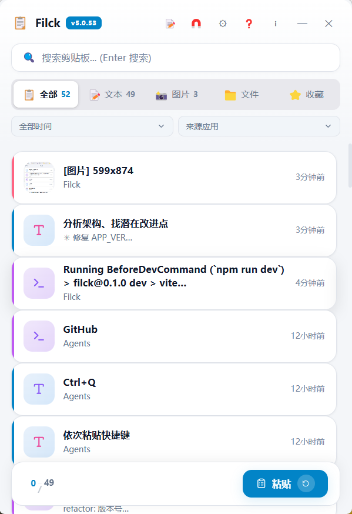
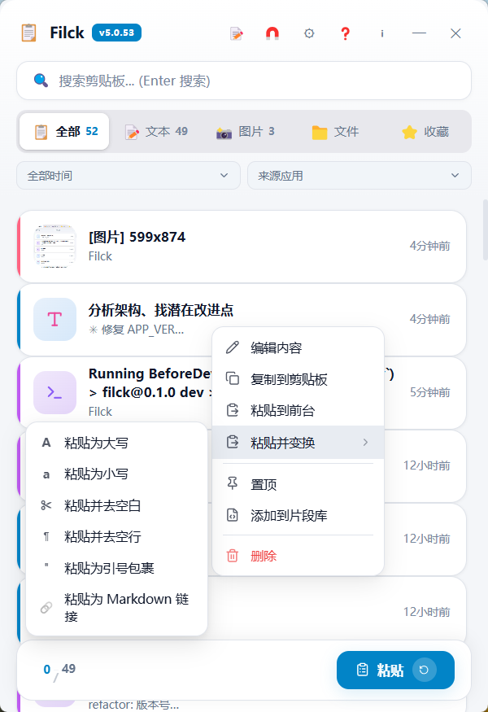
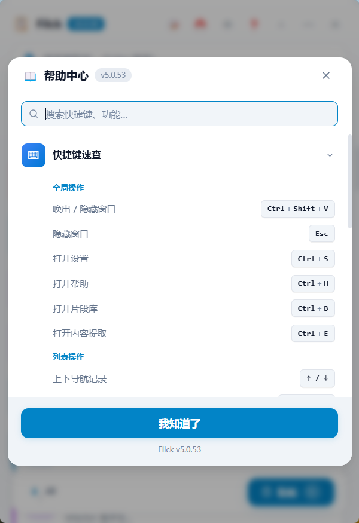

# PastePanda — 智能剪贴板管理器

> 🚀 一款基于 Tauri 2 的 Windows 桌面剪贴板管理工具，支持文本/图片/文件历史记录、全局热键粘贴、工作区管理、局域网同步。

<p align="center">
  
</p>

<p align="center">
  
  
  
  
  
  
  
</p>

---

## ✨ 核心功能

| 功能 | 说明 |
|------|------|
| 📋 **剪贴板历史** | 自动记录文本、图片、文件，400ms 轮询 + MD5 去重 |
| ⌨️ **全局热键** | 呼出窗口 `Ctrl+Shift+V`、依次粘贴 `Ctrl+Q`、索引粘贴 `Ctrl+Alt+1~9` |
| 📌 **粘贴到前台** | 文本/图片通过 WM_PASTE 消息注入到目标窗口 |
| 🏷️ **工作区管理** | 多工作区隔离历史记录 |
| 🔍 **搜索与筛选** | 拼音首字母搜索、类型筛选、标签分类 |
| 📝 **片段库** | 常用文本模板管理 |
| 🔗 **信息提取** | 自动识别电话号码、邮箱、URL |
| 🌐 **局域网同步** | 多设备间同步文本/图片/文件 |
| 🎨 **4 套主题** | 浅色/深色/蔚蓝/蔚蓝深色 |
| ⚙️ **系统集成** | 系统托盘、开机自启、数据导入/导出（JSON） |
| 🔄 **自动更新** | GitHub Releases 自动检测与静默更新 |

### ⌨️ 快捷键速查

| 快捷键 | 功能 |
|--------|------|
| `Ctrl+Shift+V` | 显示/隐藏窗口 |
| `Ctrl+Q` | 依次粘贴（默认，可在设置中修改） |
| `Ctrl+Alt+1~9` | 索引粘贴前 9 条 |
| `Enter` | 粘贴选中项 |
| `Ctrl+C` | 仅复制不粘贴 |
| `Ctrl+F` | 聚焦搜索框 |
| `Escape` | 关闭窗口 |

---

## 🖥️ 界面预览

| 主界面 | 设置 |
|--------|------|
|  |  |

| 右键菜单 | 帮助 |
|----------|------|
|  |  |

---

## 📦 安装

### 下载预编译版本

前往 [Releases](https://github.com/lzlkyb/pastepanda/releases) 页面下载最新 `.exe` 安装包。

### 系统要求

- **操作系统**: Windows 10/11 (64位)
- **运行时**: 无需额外安装，自带 WebView2

---

## 🛠️ 技术栈

### 前端

| 技术 | 用途 |
|------|------|
| React 19 | UI 框架 |
| TypeScript | 类型安全 |
| Vite 7 | 构建工具 |
| Zustand | 状态管理 |
| Radix UI | 无障碍 UI 组件 |
| Framer Motion | 动画 |
| Lucide React | 图标库 |
| Tailwind CSS | 样式系统 |

### 后端 (Rust)

| 依赖 | 用途 |
|------|------|
| Tauri 2 | 桌面框架 |
| rusqlite (bundled) | SQLite 数据库 |
| arboard | 剪贴板读写 |
| tokio | 异步运行时 |
| image | 图片处理/缩放 |
| windows | Win32 API 调用 |
| pinyin | 中文拼音搜索 |

---

## 🏗️ 项目结构

```
├── src/                    # React 前端
│   ├── components/         # UI 组件
│   │   ├── CardList.tsx    # 卡片列表（核心组件）
│   │   ├── SettingsDialog.tsx  # 设置对话框
│   │   ├── HelpDialog.tsx  # 帮助/快捷键说明
│   │   ├── AboutDialog.tsx # 关于/更新
│   │   └── ...
│   ├── stores/             # Zustand 状态管理
│   ├── lib/                # API 封装 + 工具函数
│   └── styles/             # CSS 样式 + 主题变量
├── src-tauri/              # Rust 后端
│   └── src/
│       ├── lib.rs          # 启动逻辑 + 命令注册
│       ├── clipboard_monitor.rs  # 剪贴板轮询监听
│       ├── paste_engine.rs # 粘贴引擎
│       ├── hotkey_manager.rs # 全局热键管理
│       ├── data_store.rs   # SQLite 数据层
│       ├── commands.rs     # Tauri Commands（35+ 个命令）
│       ├── tray_manager.rs # 系统托盘
│       └── lan_sync.rs     # 局域网同步
└── docs/                   # 文档
```

---

## 🔧 开发指南

### 环境要求

- **Rust** ≥1.70 ([rustup.rs](https://rustup.rs))
- **Node.js** ≥20 ([nodejs.org](https://nodejs.org))
- **Visual Studio 2022 Build Tools** — "使用 C++ 的桌面开发" + Windows SDK

### 快速开始

```bash
# 克隆仓库
git clone https://github.com/lzlkyb/pastepanda.git
cd pastepanda/clipboard-manager-tauri

# 安装依赖
npm install

# 开发模式
npm run tauri dev

# 生产构建
npm run tauri build
```

---

## 🤝 贡献

欢迎提交 Issue 和 Pull Request！

1. Fork 本仓库
2. 创建特性分支 (`git checkout -b feature/amazing-feature`)
3. 提交更改 (`git commit -m 'Add amazing feature'`)
4. 推送到分支 (`git push origin feature/amazing-feature`)
5. 创建 Pull Request

---

## 📄 许可证

MIT © 2025 PastePanda

---

<p align="center">
  <sub>Made with ❤️ using Tauri + React + Rust</sub>
</p>
